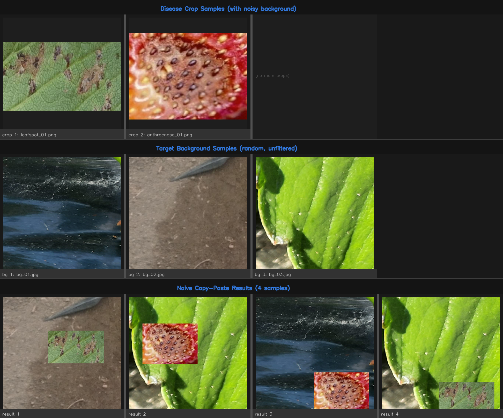
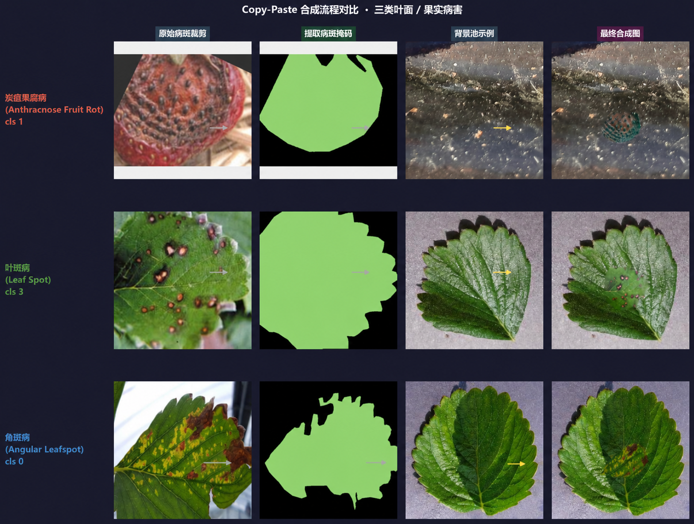

# Strawberry Disease Detection with Lightweight YOLO

This repository contains a lightweight YOLO-based strawberry disease detection pipeline. The project focuses on greenhouse strawberry disease detection, data cleaning, targeted Copy-Paste augmentation, out-of-distribution false-positive reduction, and a deployable inference workflow.

The final detector is based on YOLOv8n, with a lightweight model design and a multi-stage training and inference pipeline.

## Project Highlights

- Lightweight YOLO-based strawberry disease detection
- Data-centric preprocessing for public Roboflow strawberry disease datasets
- Duplicate and near-duplicate image cleaning before training
- Stratified train/validation/test split reconstruction
- Healthy negative sample construction for false-positive stress testing
- Dual-reservoir Copy-Paste augmentation for minority disease classes
- Multi-scale ensemble inference and adaptive confidence filtering
- Clear separation between code and public datasets with uncertain redistribution rights

## Data Source

The disease training data used in this project was collected and reorganized from public strawberry disease datasets on Roboflow Universe:

https://universe.roboflow.com/search?q=strawberry+disease

The datasets are not included in this repository because redistribution rights may vary across individual public dataset sources. Users should download data from the original sources, check the corresponding licenses, and prepare the local directory structure before training.

## Why Data Preprocessing Matters

Public strawberry disease datasets are useful starting points, but they often contain issues that can make validation results overly optimistic or reduce real-world robustness:

1. Duplicate or near-duplicate images from continuous shooting, local cropping, or small camera changes.
2. Similar images leaking across train, validation, and test splits.
3. Class imbalance after duplicate removal, especially for leaf spot and angular leafspot.
4. Background shortcut learning from black mulch film, soil, white achenes, trichomes, specular highlights, and immature fruit.
5. False positives on healthy strawberries when no dedicated negative stress set is used.

Because of these issues, this project treats data cleaning and dataset construction as part of the method rather than a simple formatting step.

## Dataset Preparation

Prepare the dataset locally with the following structure:

```text
datasets/
  the_big/
    train/images
    train/labels
    valid/images
    valid/labels
    test/images
    test/labels

  pd_test/
    # healthy OOD strawberry images for false-positive stress testing

  bg_for_copypaste/
    # black mulch film / soil backgrounds for anthracnose Copy-Paste

  bg_for_leafspot/
    # clean green leaf backgrounds for leaf spot and angular leafspot Copy-Paste
```

The dataset construction process used in this project includes:

- merging public strawberry disease datasets;
- removing duplicate and near-duplicate images;
- rebuilding train/validation/test splits with stratified sampling;
- separating healthy negative samples and background-only images;
- constructing Copy-Paste background reservoirs for targeted augmentation.

## Healthy Negative Samples

Healthy negative samples are important for reducing false positives on real strawberry images.

The `pd_test` set is intended for healthy strawberry stress testing, including scenes with:

- half-ripe fruit with pale or white regions;
- dense white achenes;
- strong highlights;
- trichomes;
- shallow-depth-of-field backgrounds;
- green immature fruit;
- soil or mud attached to leaves.

Large language models such as ChatGPT or Claude can help generate search keywords and collection prompts for healthy negative samples. However, the actual images should always be manually checked for:

- whether the strawberry is truly healthy;
- whether the image license allows research use;
- whether the scene is useful for false-positive stress testing;
- whether there are hidden disease symptoms.

AI-generated search suggestions should not be treated as a data source by themselves.

## Copy-Paste Augmentation

This project uses a dual-reservoir Copy-Paste strategy instead of random Copy-Paste.

Traditional Copy-Paste may paste lesions onto unrelated backgrounds and may carry surrounding highlights, veins, or noisy textures into the generated sample. This can make the model learn incorrect correlations between disease labels and background artifacts.

The dual-reservoir strategy separates lesion instances and host backgrounds:

| Disease class | Synthetic samples | Background reservoir |
| --- | ---: | --- |
| Anthracnose Fruit Rot | 30 | black mulch film / soil |
| Leaf Spot | 120 | clean green leaves |
| Angular Leafspot | 100 | clean green leaves |

The goal is not only to increase the number of samples, but also to reduce coupling between disease lesions and irrelevant background noise.

### Copy-Paste Comparison

Traditional Copy-Paste:



Dual-reservoir Copy-Paste used in this project:



## Project Structure

```text
configs/
  the_big.yaml

scripts/
  train_pipeline_v3.py
  generate_anthracnose_copypaste.py
  generate_leaf_copypaste.py

docs/
  figures/
    traditional_copypaste.png
    dual_reservoir_copypaste.png
```

## Training

Run the full V3 pipeline:

```bash
python scripts/train_pipeline_v3.py
```

Run a single stage:

```bash
python scripts/train_pipeline_v3.py --stage 1
python scripts/train_pipeline_v3.py --stage 2
python scripts/train_pipeline_v3.py --stage 3
```

The pipeline contains three stages:

1. Stage 1: full training on the cleaned dataset with targeted Copy-Paste augmentation.
2. Stage 2: frozen-backbone fine-tuning from the Stage 1 model.
3. Stage 3: multi-scale ensemble inference and filtering for saved-model evaluation.

## OOD False-Positive Stress Test

The project uses a healthy OOD stress test set to evaluate false positives, especially for powdery mildew.

Powdery mildew can be confused with:

- white trichomes;
- dense white achenes;
- half-ripe pale fruit regions;
- specular highlights;
- shallow-depth-of-field blur.

For this reason, standard mAP is not the only evaluation criterion. The number of false-positive boxes on healthy OOD images is also used to select and evaluate the model.

## Main Results

| Metric | Result |
| --- | ---: |
| mAP@0.5 | 0.887 |
| Model weight size | 5.97 MB |
| Powdery mildew false-positive boxes on OOD stress test | 38 -> 6 |
| False-positive reduction | 84% |

The results suggest that data cleaning, dual-reservoir Copy-Paste augmentation, and class-specific confidence filtering are useful for reducing false positives in greenhouse strawberry disease detection.

## Model Weights

Model weights and training outputs are not tracked in Git. Train locally or publish selected weights separately through GitHub Releases.

Recommended ignored files:

```text
runs/
results/
models/
*.pt
*.onnx
*.engine
```

## Notes on Dataset Usage

If you reuse or extend this project, please carefully check:

- the license of the original Roboflow datasets;
- whether duplicate images exist across datasets;
- whether similar images leak across train/validation/test splits;
- whether healthy negative samples are truly disease-free;
- whether synthetic Copy-Paste samples look realistic;
- whether the model is overfitting to greenhouse-specific backgrounds.

This project is intended for academic research and prototype development. More real-field validation is required before practical agricultural deployment.
